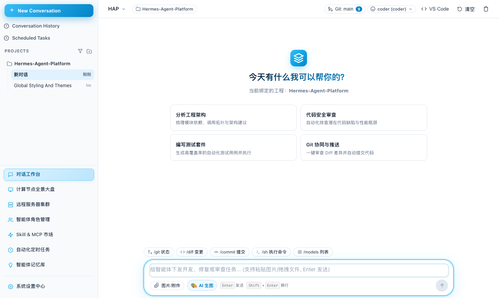
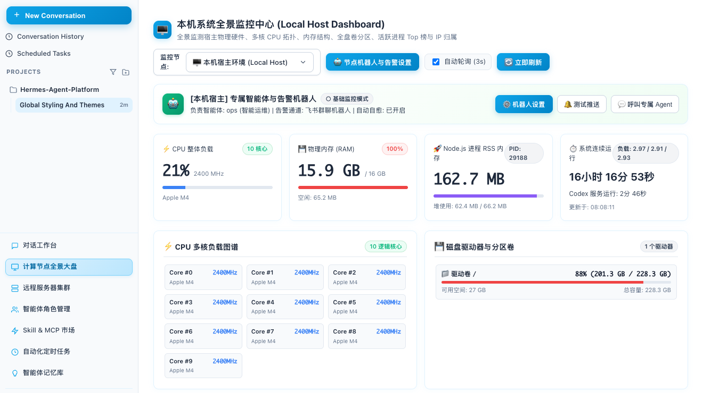

# Hermes Agent Platform（HAP）

一个基于 Electron 和 TypeScript 的多智能体工作台，将模型配置、项目对话、智能体角色、消息通道和主机管理集中在同一个桌面应用中。也可以通过 CLI 或 HTTP 接口运行任务，通过 TOML 文件管理服务商、模型与智能体。

桌面安装包的产品名称为 **CodexConnect**，源码与命令行沿用 **HAP** 命名。

[界面预览](#界面预览) · [快速开始](#快速开始) · [安装包打包](#安装包打包) · [CLI 全景](#cli-全景) · [开发](#开发)

## 它解决什么

- 多模型接入。内置 8 家服务商预置，支持通过界面或命令行管理服务商与模型，无需修改源码。
- 智能体各司其职。声明式生成，每个智能体绑自己的主模型、降级链、工具档位、子智能体白名单。
- 手机端就是终端。Telegram 长轮询或 webhook 双模式，`@智能体id` 开头即可定向派活。
- 跑挂了能查。每个任务落一份 JSONL 轨迹，token 用量按智能体与模型聚合。


## 界面预览

以下为开发版本的实际界面截图，复用自仓库中的界面验证记录；已裁去底部本机配置路径，界面细节可能随版本变化。

### 对话工作台

按项目组织会话，选择智能体角色，提交文本、图片或文件，并访问 Git 与开发工具入口。



### 主机监控

集中查看 CPU、内存、磁盘与系统运行状态，并配置节点机器人和告警入口。



## 快速开始

### 环境要求

- 推荐 Node.js 22 LTS 与 npm。项目声明 Node.js >=20，部分依赖可能要求更新的小版本。
- 桌面端使用 Electron；模型调用需要相应服务商的 API Key，或可访问的本地 Ollama 服务。
- `better-sqlite3` 是原生依赖。没有可用预编译包时，macOS 需要 Xcode Command Line Tools，Windows 需要 Python 与 Visual Studio Build Tools 的“使用 C++ 的桌面开发”组件。

### 启动桌面端

在项目根目录执行，macOS 终端和 Windows PowerShell 均适用：

```bash
npm install
npm run gui
```

`gui` 会编译 TypeScript、复制界面资源、为 Electron 重建 SQLite 模块并启动桌面窗口。首次启动和重建原生模块可能需要较长时间。

进入系统设置配置服务商、API Key 和模型，再到智能体角色管理中指定模型，回到对话工作台选择项目与智能体后开始对话。

### 使用命令行

CLI 与桌面端使用不同的 Node.js 运行时。从桌面端切回 CLI 前，先执行 `npm run rebuild:node`。以下以默认使用 DeepSeek 的 `researcher` 智能体为例。

macOS / Linux：

```bash
npm run rebuild:node
npm run hap -- init
export DEEPSEEK_API_KEY='替换为你的 API Key'
npm run hap -- doctor --skip-network
npm run hap -- run "用三句话解释 TOML 的表数组" -a researcher
```

Windows PowerShell：

```powershell
npm run rebuild:node

# 1) 写出配置骨架：8 家服务商、9 个模型、5 个智能体
npx tsx src/cli/bin.ts init

# 2) 导出你要用的 Key（只需要用到的那几家）
$env:DEEPSEEK_API_KEY = 'sk-...'

# 3) 体检：配置可解析性、凭据齐全度、服务商连通性
npx tsx src/cli/bin.ts doctor --skip-network

# 4) 单跑一次任务，确认链路通
npx tsx src/cli/bin.ts run "用三句话解释 TOML 的表数组" -a researcher

# 5) 拉起手机端
$env:TELEGRAM_BOT_TOKEN = '123456:ABC...'
# 先在 config.toml 中将 channels.telegram.default_agent 设为 researcher
npx tsx src/cli/bin.ts serve
```

默认配置位于 `~/.hap/config.toml`。已有配置时不要随意使用 `init --force`，它会覆盖配置。`doctor` 可能报告未使用服务商缺少凭据，按实际需要配置；去掉 `--skip-network` 可检查网络连通性。

下文的 `hap` 是 `npm run hap --` 的简写，并不是安装依赖后自动注册的全局命令。例如 `hap agent list` 实际执行 `npm run hap -- agent list`。多行 PowerShell 示例使用反引号续行，macOS / Linux 请改用反斜杠或合并为一行。

## 安装包打包

当前 `package.json` 已配置 Windows 的 NSIS 安装程序和 Portable 便携包，输出目录为 `release/`。`npm run dist` 固定打包 Windows；macOS 使用下面的显式命令。

### 准备打包工具

项目目前未在开发依赖中声明 `electron-builder`，首次打包先安装，并将依赖与锁文件变更一并纳入版本管理：

```bash
npm install
npm install -D electron-builder
```

### macOS

在 Mac 上执行：

```bash
npm run build
npx electron-builder --mac dmg --arm64
```

Apple Silicon 使用 `--arm64`，Intel Mac 改为 `--x64`；同时生成两种架构的独立安装镜像可使用 `--arm64 --x64`。输出 `.dmg` 位于 `release/`，打开后将应用拖入 Applications 文件夹。

### Windows

在 Windows PowerShell 中执行：

```powershell
npm run dist
```

`release/` 中会生成 NSIS 安装程序 `.exe` 和 Portable 便携版 `.exe`。安装程序支持选择安装目录、创建桌面与开始菜单快捷方式。仅生成解包目录用于检查时，执行 `npm run dist:dir`。

### 分发与验证

- 建议分别在 macOS 与 Windows 上构建。项目包含 `better-sqlite3` 原生模块，跨系统打包需要额外处理目标平台的原生依赖。
- 对外发布 macOS 版本应配置 Developer ID 签名与 Apple 公证；Windows 建议配置代码签名，减少未知发布者提示。
- 上述命令是构建步骤，不代表安装包已经通过验证。发布前需在目标系统上检查安装、启动、模型调用、SQLite 会话读写和卸载流程。

### 常见问题

| 问题 | 处理方式 |
| --- | --- |
| `NODE_MODULE_VERSION` 不匹配或 SQLite 模块无法加载 | CLI / 测试前执行 `npm run rebuild:node`；桌面端执行 `npm run gui`，它会自动重建 Electron 模块 |
| 原生模块编译失败 | macOS 执行 `xcode-select --install`；Windows 安装 Python 与 Visual Studio C++ 构建工具 |
| 找不到 API Key 或模型调用失败 | 核对所选智能体绑定的服务商、模型别名和环境变量，运行 `npm run hap -- doctor` |
| Mac 上执行 `npm run dist` 却开始打 Windows 包 | 该脚本包含 `--win`，请使用上面的 `--mac dmg` 命令 |
| Electron 或打包工具下载失败 | 检查网络、代理及 npm 配置后重试 |

## 运行时加服务商与模型

这是对齐 OpenCodex 的核心能力：服务商与模型都是配置数据，不是代码分支。

```powershell
# 自建网关：继承 deepseek 预置的线制与协议，只换地址
hap provider add mycorp --preset deepseek --base-url https://gw.example.com/v1

# 从零声明一家：线制、协议、请求头、输出上限全可指定
hap provider add acme `
  --base-url https://api.acme.ai/v1 `
  --env-key ACME_API_KEY `
  --wire-api chat `
  --protocol openai-tools `
  --header X-Title=HAP `
  --env-header X-Trace=ACME_TRACE `
  --max-tokens-default 4096

# 挂模型到这家服务商
hap model add acme-large --provider acme --model acme-large-v2 `
  --context-window 200000 --max-output-tokens 16384 `
  --capability tools --capability streaming --param temperature=0.3

# 或者直接把服务商暴露的模型列表批量导入
hap model import acme --filter large --dry-run
hap model import acme --filter large

# 查、删
hap provider list
hap provider check acme
hap model list --provider acme
hap model remove acme-large
```

不带任何选项执行 `hap provider add <id>` 或 `hap model add <alias>` 会进入交互问答，适合第一次配。脚本里请显式给参数，否则会挂在问答上。

### 内置服务商预置

| 预置 | base_url | 环境变量 | 线制 | 默认协议 |
| --- | --- | --- | --- | --- |
| deepseek | `https://api.deepseek.com/v1` | `DEEPSEEK_API_KEY` | chat | deepseek |
| openai | `https://api.openai.com/v1` | `OPENAI_API_KEY` | responses | openai-tools |
| anthropic | `https://api.anthropic.com` | `ANTHROPIC_API_KEY` | anthropic-messages | anthropic |
| zhipu | `https://open.bigmodel.cn/api/paas/v4` | `ZHIPU_API_KEY` | chat | openai-tools |
| gemini | `https://generativelanguage.googleapis.com/v1beta/openai/` | `GEMINI_API_KEY` | chat | openai-tools |
| openrouter | `https://openrouter.ai/api/v1` | `OPENROUTER_API_KEY` | chat | openai-tools |
| nous | `https://inference-api.nousresearch.com/v1` | `NOUS_API_KEY` | chat | hermes-native |
| ollama | `http://localhost:11434/v1` | 无 | chat | hermes-native |

三个概念别混：**线制**是 HTTP 层长什么样（`chat` 走 Chat Completions、`responses` 走 OpenAI Responses、`anthropic-messages` 走 Anthropic Messages）；**协议**是工具调用怎么表达（`openai-tools` 原生 tools 字段、`deepseek` 兼容其推理字段、`anthropic` 走 content blocks、`hermes-native` 解析 `<tool_call>` 标签流）；**模型别名**是你在智能体里引用的名字。

九个内置模型别名：`deepseek-chat`、`deepseek-reasoner`、`claude-sonnet-4-5`、`gpt-5-codex`、`glm-4.6`、`gemini-2.5-pro`、`gemini-2.5-flash`、`hermes-4-405b`、`hermes3:8b`。

## 声明式生成智能体

```powershell
# 从模板起，覆盖主模型
hap agent create qa --template reviewer --model deepseek/deepseek-chat --name "QA 审查员" --emoji 🔍

# 完全自定义：降级链、工具档位、子智能体、职责提示
hap agent create trader `
  --model anthropic/claude-sonnet-4-5 `
  --fallback deepseek/deepseek-reasoner --fallback openrouter/glm-4.6 `
  --utility-model deepseek/deepseek-chat `
  --tools-profile research `
  --deny-tool shell `
  --subagent researcher `
  --mode persistent `
  --prompt "你负责盘面复盘，只输出结论与依据，不写代码。"

hap agent list
hap agent show trader
hap agent update trader --param temperature=0.2
hap agent remove trader   # 只删配置条目，工作目录与会话库保留
```

`--prompt` 会把内容写进该智能体状态目录下的 `system.md` 并回填 `system_prompt_file`，之后你可以直接编辑那个文件。

### 骨架自带的五个智能体

| id | 主模型 | 工具档位 | 职责 |
| --- | --- | --- | --- |
| coder | `anthropic/claude-sonnet-4-5` | coding | 写代码、改代码、跑命令；可派生 researcher / reviewer |
| researcher | `deepseek/deepseek-reasoner` | research | 查资料、读文件、汇总结论 |
| reviewer | `openai/gpt-5-codex` | coding（禁 shell/写入） | 只读式代码审查 |
| writer | `zhipu/glm-4.6` | standard | 文档与文案 |
| ops | `gemini/gemini-2.5-flash` | minimal | 轻量问答与状态查询 |

第六个模板 `vision`（`gemini/gemini-2.5-pro`）不在骨架里，需要时 `hap agent create <id> --template vision`。

### 工具档位

| 档位 | 包含工具 |
| --- | --- |
| minimal | read_file、list_dir |
| standard | 文件读写、搜索、HTTP 请求，以及主机信息、符号检索和图像生成等工具 |
| coding | 文件读写、shell、补丁、子智能体、远程执行与开发辅助工具 |
| research | 文件读写、搜索、HTTP 请求、子智能体与信息查询工具 |
| full | 全部内置工具 |

完整工具清单以 [src/config/defaults.ts](src/config/defaults.ts) 中的 `TOOL_PROFILES` 为准。

`--allow-tool` 在档位之上收窄，`--deny-tool` 优先级最高。MCP 工具名写成 `server__tool` 形式。

## 手机端：Telegram

```toml
[channels.telegram]
enabled = true
token_env = "TELEGRAM_BOT_TOKEN"
mode = "polling"          # 或 "webhook"
default_agent = "coder"
mention_patterns = ["@hap"]

# webhook 模式追加这一段
[channels.telegram.webhook]
url = "https://your.domain/hap/telegram"
bind = "0.0.0.0:8788"
path = "/hap/telegram"
```

polling 适合本地和内网，开箱即用；webhook 适合有公网域名的部署，启动时自动调 `setWebhook`。两者互斥，启动期校验。

聊天里可用的指令：

| 指令 | 作用 |
| --- | --- |
| `/agents` | 列出全部智能体 |
| `/agent <id>` | 查看某个智能体的模型与工具集 |
| `/status` | 当前会话状态与今日用量 |
| `/trace [任务id]` | 任务执行轨迹 |
| `/usage [天数]` | 用量聚合，默认 7 天 |
| `/stop` | 中止当前会话正在跑的任务 |
| `/new` | 清空当前会话历史 |
| `/help` | 显示帮助 |

直接发消息即下发任务。`@researcher 查一下 TOML 1.0 的日期类型` 这样以 `@智能体id` 开头就能定向派活，不写则用 `default_agent`。长任务会先回一条占位消息，随后按 `edit_interval_ms` 节流地编辑同一条消息推进度；超过 `async_threshold_ms` 的任务转为异步模式，完成后再推终态。

## 手机端：微信与企业微信 (WeChat / WeCom)

平台原生支持四种微信接入模式：**个人微信扫码绑定 iLink Bot**、**Wechaty Puppet Service**、**企业微信（WeCom）机器人与自建应用**、**微信公众号**。

```toml
[channels.wechat]
enabled = true
mode = "ilink_bot"            # 可选 "ilink_bot" | "personal" | "wecom" | "official_account"
default_agent = "coder"
mention_patterns = ["@hap"]
message_char_limit = 2048
auth_dir = "~/.hap/wechat-auth"
qr_log = true                 # 启动时是否在终端打印扫码二维码

# iLink Bot 模式不需要 WECHATY_PUPPET_SERVICE_TOKEN。
# 手机微信扫码后绑定的是腾讯 iLink Chatbot 身份，不是把个人微信账号本身登录成自动回复客户端。
[channels.wechat.personal]
puppet = "ilink"
ilink_account_id = "bot-local"

# 企业微信 WeCom 模式可选配置
[channels.wechat.wecom]
corp_id = "ww1234567890abcdef"
corp_secret_env = "WECHAT_WECOM_CORP_SECRET"
agent_id = 1000002
token = "your_wecom_token"
encoding_aes_key = "your_encoding_aes_key"
webhook_url_env = "WECHAT_WECOM_WEBHOOK_URL"
bind = "0.0.0.0:8789"
path = "/wecom"
```

### 使用方式：
1. **个人微信扫码绑定 iLink Bot**：执行 `hap serve` 或在 GUI 控制台点选「微信 / 企微连接」→「启动微信服务」，使用手机微信扫码绑定机器人身份，凭据自动持久化，支持私聊指令。
2. **Wechaty Puppet Service**：仅在显式配置 `mode = "personal"` 且 `[channels.wechat.personal].puppet = "service"` 时启用，需要供应商提供 `WECHATY_PUPPET_SERVICE_TOKEN`。
3. **企业微信 WeCom**：在企业微信后台配置应用或群机器人 Webhook，按对应接入方式配置凭据与回调地址。

## HTTP 通道

```toml
[channels.http]
enabled = true
bind = "127.0.0.1:8787"
default_agent = "coder"
```

| 方法与路径 | 作用 |
| --- | --- |
| `GET /health` | 存活探测，返回智能体 id 列表 |
| `GET /agents` | 智能体 id 列表 |
| `GET /status/:session` | 会话状态（结构化 + 文本两份） |
| `GET /trace/:taskId` | 任务轨迹摘要，找不到返回 404 |
| `GET /usage?days=7` | 用量聚合 |
| `POST /stop/:session` | 中止该会话的任务 |
| `POST /run` | 同步执行，一次性返回终态 |
| `POST /stream` | SSE 流式返回事件 |
| `POST /message` | 走通道调度器，与 Telegram 同一套渲染逻辑 |

请求体形如 `{ "prompt": "...", "agent": "researcher", "session": "http:demo" }`。

## CLI 全景

| 命令 | 作用 |
| --- | --- |
| `hap init [--force]` | 写入配置骨架 |
| `hap serve [--with-cli]` | 拉起全部启用的通道 |
| `hap run <prompt...>` | 单次执行，支持 `-a` 指定智能体、`-s` 指定会话、`--quiet`、`--no-persist` |
| `hap chat` | 本地交互式对话 |
| `hap config path|keys|explain <key>|limits|channels` | 配置自省 |
| `hap provider list|presets|add|remove|check|models` | 服务商管理 |
| `hap model list|presets|add|remove|import` | 模型目录管理 |
| `hap agent list|templates|show|create|update|remove` | 智能体管理 |
| `hap status [session]` / `hap trace <taskId>` / `hap stop <session>` | 运行时观测与干预 |
| `hap usage [-d n]` / `hap prune [-d n]` | 用量统计与记录清理 |
| `hap doctor [--skip-network]` | 全面体检 |

全局选项：`-c/--config` 指定配置文件、`-p/--profile` 切档位、`--json` 输出结构化结果给脚本消费。

`hap config explain` 值得单独提一句。配置走六层覆盖（`cli` → `env` → `agent` → `profile` → `defaults` → `builtin`），排查「为什么这个智能体用的不是我想要的模型」时：

```powershell
hap config explain model -a coder
```

会把六层各自的取值、出处、以及哪一层胜出全列出来。

## 配置档位

`profiles` 用来整体切换一批默认值，最典型的是云端与本地离线两套：

```toml
active_profile = "cloud"

[profiles.cloud]
default_model = "deepseek/deepseek-chat"

[profiles.local]
default_model = "ollama/hermes3:8b"
utility_model = "ollama/hermes3:8b"
protocol = "hermes-native"
```

`hap -p local run "..."` 即可临时切到本地模型跑，不动配置文件。

## 目录约定

| 配置键 | 缺省值 | 存什么 |
| --- | --- | --- |
| `paths.data_dir` | `~/.hap` | SQLite 会话库与派生目录的根 |
| `paths.trace_dir` | `<data_dir>/traces` | 每任务一份 JSONL 轨迹 |
| `paths.overflow_dir` | `<data_dir>/overflow` | 超长工具输出的落盘副本 |
| `paths.spool_dir` | `<data_dir>/spool` | 出站消息暂存，用于断连重投 |
| `agents.defaults.workspace_root` | `~/.hap/workspaces` | 各智能体的文件工作目录父级 |
| `agents.defaults.agent_dir_root` | `~/.hap/agents` | 各智能体的状态目录父级（含 `system.md`） |

## 配额上限

`limits` 表控制运行时边界，全部可按智能体覆盖：`max_iterations`（默认 24）、`max_subagent_depth`（3）、`tool_timeout_ms`（120000）、`tool_output_max_bytes`（262144，超出落 overflow）、`compact_threshold`（0.8，触发历史压缩）、`daily_token_budget`（5000000）、`session_retention_days`（30）、`ingress_queue_size`（1000）、`default_provider_concurrency`（4）、`default_agent_concurrency`（2）。

`hap config limits` 看生效值。

## MCP 工具接入

```toml
[mcp_servers.filesystem]
command = "npx"
args = ["-y", "@modelcontextprotocol/server-filesystem", "D:/work"]
```

启动时自动发现工具并注册成 `filesystem__read_file` 这类名字，在智能体的 `--allow-tool` / `--deny-tool` 里按这个名字引用。`hap doctor` 会报告加载失败的服务器。

## 开发

```powershell
npm run typecheck   # tsc --noEmit
npm run rebuild:node # 从 Electron 切回 Node.js 原生模块
npm test            # vitest run
npm run lint        # eslint
npm run build       # 编译 TypeScript 并复制桌面端资源
```

### 源码结构

| 目录 | 职责 |
| --- | --- |
| `src/gui` | Electron 主进程、IPC、桌面界面与应用服务 |
| `src/cli` / `src/web` | 命令行与 Web 服务入口 |
| `src/config` | TOML 加载、校验、配置解析与写回 |
| `src/providers` / `src/protocol` | 模型服务商接入、协议适配与流式解析 |
| `src/agent` / `src/tools` | 智能体编排、内置工具与 MCP 接入 |
| `src/channels` | Telegram、微信、飞书、QQ、WhatsApp 与 HTTP 等通道实现 |
| `src/remote` / `src/system` | SSH 远程管理与本机系统信息 |
| `src/storage` / `src/memory` / `src/scheduler` | 会话存储、智能体记忆与定时任务 |
| `src/control-plane` / `src/security` | 授权、策略与网络访问控制 |
| `src/telemetry` / `src/domain` | 用量观测、领域类型与错误定义 |
| `tests` | 自动化测试 |

架构与功能设计可参阅 [项目规格](specs/hermes-agent-platform.spec.md)。提交前按变更范围执行类型检查、测试和 lint；文档中的截图存放在 `docs/images/`。
