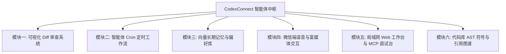

# CodexConnect (Hermes Agent Platform) 架构演进与新功能开发规格说明书

- **文档版本**：v1.2.0
- **编制日期**：2026-08-28
- **适用架构**：Node.js 22+ / TypeScript 5.8+ / Electron / SQLite / Vector RAG / Multi-Channel Ingress

---

## 1. 演进愿景与目标

CodexConnect（原 Hermes Agent Platform）已构建起完备的多模型路由、多智能体编排、多通道消息收发（微信/Telegram/WhatsApp/HTTP/CLI）以及远端服务器守护体系。

为了将系统从**“被动响应型辅助编码助手”**升级为**“具备企业级自主交付能力的 AI 研发与运维操作系统”**，规划以下 **6 大核心功能模块** 的深度演进。



---

## 2. 模块一：可视化代码审查与 Diff 合并系统 (Visual Diff System)

### 2.1 需求背景与痛点
当前智能体在修改项目代码时，主要以文本 patch 和日志形式呈现。开发者无法直观对比修改前后的差异，缺乏类似 VS Code / GitHub PR 级别的行级对比、一键接受或部分放弃修改的控制能力。

### 2.2 功能架构与交互设计
1. **Side-by-Side / Inline 双模式对比视图**：
   - 采用 Monaco Editor Diff 组件或轻量级 Virtual DOM Diff 高亮引擎。
   - 绿色高亮新增行（`+`），红色高亮删除行（`-`），黄色高亮变更行。
2. **多文件变更树（File Change Tree）**：
   - 左侧列出本次任务影响的所有文件列表（如 `[M] src/auth/jwt.ts (+12, -3)`、`[A] src/auth/jwt.test.ts (+45)`）。
3. **变更操作控制条**：
   - **`[✓ 接受全部修改]`**：将 Patch 正式合并并写入磁盘，触发 `git add`。
   - **`[✗ 全部回滚]`**：调用内置回滚机制，瞬间还原文件修改前状态。
   - **`[🔍 文件级审查]`**：逐文件单步确认或跳过。

### 2.3 数据结构与 IPC 契约

```typescript
export interface FileDiffItem {
  path: string;
  relativePath: string;
  status: 'modified' | 'added' | 'deleted';
  oldContent?: string;
  newContent?: string;
  additions: number;
  deletions: number;
  chunks: Array<{
    oldStart: number;
    oldLines: number;
    newStart: number;
    newLines: number;
    diffLines: string[];
  }>;
}

export interface DiffReviewSession {
  sessionId: string;
  taskId: string;
  files: FileDiffItem[];
  status: 'pending' | 'accepted' | 'rejected' | 'partial';
}
```

---

## 3. 模块二：主动式定时任务与自动化工作流调度器 (Agent Cron Engine)

### 3.1 需求背景与痛点
当前智能体必须等待外部消息（GUI、微信、Telegram）被动触发。在团队协作中，大量任务（如每日代码巡检、定时同步 PR、夜间跑测试、服务器指标报警）需要智能体主动、定时、周期性地自主执行。

### 3.2 核心功能设计
1. **标准 5/6 字段 Cron 调度器**：
   - 支持可视化配置（例如：`每天 09:00`、`每小时整点`、`工作日 18:30`）。
2. **工作流蓝图 (Workflow Blueprint)**：
   - 允许将多步任务串联为自动化流水线：
     - *步骤 1*：执行 `git pull origin main`；
     - *步骤 2*：调度 `reviewer` 智能体分析昨天的 Commit 列表；
     - *步骤 3*：生成格式化 Markdown 评审日报；
     - *步骤 4*：通过微信 / Telegram 机器人推送到对应群聊。
3. **主动异常报警与健康巡检**：
   - 配合 Remote Server RPC 接口，周期性拉取服务器 CPU、内存、磁盘及进程状态。
   - 当 `cpuUsagePercent > 90%` 或 `loadAvg[0] > cpuCount * 2` 时，自动启动 `ops` 智能体执行 `top / ps` 定位罪魁祸首，并将诊断报告主动下发至手机微信。

### 3.3 配置与存储 Schema (`hap.toml` 扩展)

```toml
[schedules.daily_code_review]
name = "每日代码晨报巡检"
cron = "0 9 * * 1-5"
agent = "reviewer"
workspace = "C:/Projects/Backend"
prompt = "拉取最新代码，审查昨日所有提交并生成性能与安全评估日报"
notify_channels = ["wechat", "telegram"]
enabled = true

[schedules.server_health_watch]
name = "远程服务器负载守卫"
cron = "*/30 * * * *"
agent = "ops"
server_id = "vps-production"
condition = "metrics.cpuUsagePercent > 85"
prompt = "检测到生产服务器 CPU 超过 85%，请执行排查脚本并报告高负载进程"
notify_channels = ["wechat"]
enabled = true
```

---

## 4. 模块三：向量长期记忆与跨会话进化库 (Vector Memory & RAG)

### 4.1 需求背景与痛点
智能体在关闭会话或开启新对话后，会彻底遗忘之前与用户的约定（例如编程偏好、私有组件库规范、特定架构约定）。

### 4.2 记忆架构设计
采用 **三层记忆金字塔架构**：

```
        ┌─────────────────────────┐
        │   Working Memory (当前)  │  <- 单次会话短期上下文 (Sliding Window)
        ├─────────────────────────┤
        │   Semantic Memory (语义) │  <- 项目领域知识 / 编码规范 (Vector RAG)
        ├─────────────────────────┤
        │  Episodic Memory (事件)  │  <- 跨会话历史经验 / 修复案例库
        └─────────────────────────┘
```

1. **向量存储引擎**：
   - 内置轻量高效的本地向量方案（如 `sqlite-vss` 或本地嵌入式向量索引），无需依赖外部重型数据库。
2. **记忆自动抽取与提炼 (Memory Extractor)**：
   - 在任务执行成功后，由 Utility 模型（如 `gemini-flash` / `deepseek-chat`）异步提炼出通用知识卡片：
     - *事实示例*：`用户要求所有 API 响应统一包装为 Result<T> 结构`。
     - *偏好示例*：`前端页面必须使用 Tailwind CSS，禁止手写内联 style`。
3. **动态提示词注入 (Context Recall)**：
   - 在接收到新 Prompt 时，自动计算向量相似度，召回 Top-3 记忆片段，无缝注入到 System Prompt 的 `## User Preferences & Past Memory` 章节中。

---

## 5. 模块四：微信端语音识别与富媒体交互增强 (WeChat Rich Ingress)

### 5.1 语音输入转写 (Voice Ingress)
- **支持场景**：用户在手机微信中直接发送语音条。
- **技术实现**：
  - 微信接收到语音音频后（`silk` / `amr` / `mp3`），后端自动调用音频解码管道转为 PCM；
  - 接入本地/远端极速 ASR 模型（如 Whisper-Base / OpenAI Audio / FunASR）；
  - 将语音精准转写为文本指令，并回传一条语音确认提示（如 *“已识别语音：帮我修复登录接口并跑单测...”*），随后启动智能体执行。

### 5.2 企微模板卡片与一键审批交互 (Interactive Cards)
- **审批交互卡片**：
  - 当智能体需要执行中高危操作（如 `shell(rm -rf)`、`git push --force`）时，向企业微信群发送带有回调按钮的模板卡片：
  ```
  【🛡️ 智能体操作授权请求】
  智能体 [ops] 申请在服务器 [prod-1] 执行命令:
  `docker-compose restart api-server`
  [ 🟢 批准执行 ]   [ 🔴 拒绝拦截 ]
  ```
  - 用户在手机微信端点击按钮，直接完成鉴权闭环。

---

## 6. 模块五：局域网 Web 工作台与 MCP 调试台 (Web & MCP Playground)

### 6.1 局域网 Web 工作台 (Headless Web Mode)
- 启动命令：`hap web --port 3000 --bind 0.0.0.0 --auth token123`
- 架构：
  - 内置 Hono Web 服务端，复用桌面前端渲染资源（静态资源托管）；
  - WebSocket 实时双向推送对话流、日志、终端输出与 Diff 数据；
  - 手机浏览器、iPad 或同网络备用电脑直接扫码打开，无感协同。

### 6.2 MCP (Model Context Protocol) 可视化调试台
- 类似 Postman 的 MCP 工具专用调试界面：
  1. **服务与工具树**：树状展示所有已连接的 MCP Server（如 `filesystem`、`fetch`、`github`、`postgres`）及其暴露的 Tool 列表与 JSON Schema 参数规范。
  2. **动态表单生成**：根据 Tool Schema 自动生成可视化的输入框、下拉框与 JSON 编辑器。
  3. **实时测试与结果回放**：一键点击 `[⚡ 发起调用]`，直观查看工具执行耗时、网络返回与原始 Payload。

---

## 7. 模块六：代码库 AST 语法分析与符号引用图谱 (AST Indexer)

### 7.1 需求背景与痛点
简单的关键词全文搜索（ripgrep）在面对重命名、类型定义追溯、函数调用链追踪时往往产生大量干扰项，导致智能体阅读过多无关文件，消耗大量 Token 且容易幻觉。

### 7.2 技术路线
1. **Tree-sitter 增量语法树解析**：
   - 覆盖常用语言（TypeScript、JavaScript、Python、Go、Rust、Java、C++）。
2. **符号表（Symbol Table）生成**：
   - 提取代码文件中的所有 `class`、`function`、`interface`、`type`、`variable` 及其定义行号、导出状态与注释。
3. **调用关系图（Call Graph）与引用检索**：
   - 提供专用内置工具 `find_definition(symbol)` 与 `find_references(symbol)`，智能体无需全文扫描，1 毫秒内即可精准定位全工程依赖。

---

## 8. 分阶段研发里程碑规划 (Milestones & Sprint Plan)

| 阶段 | 周期 | 核心交付成果 | 验收标准 |
| :--- | :---: | :--- | :--- |
| **Sprint 1 (交互质变)** | 1~2 周 | **可视化 Diff 审查面板** + **微信实时交互面板优化** | 聊天流可直观展开代码对比；支持文件级一键接受与回滚。 |
| **Sprint 2 (主动协同)** | 2~3 周 | **Agent Cron 调度引擎** + **主动报警工作流** | 支持在配置文件/GUI 中添加定时任务并自动向微信/TG 推送报告。 |
| **Sprint 3 (移动增强)** | 2 周 | **微信语音转写输入** + **企微交互式审批卡片** | 手机微信发语音条可直接转写执行；高危命令微信一键授权。 |
| **Sprint 4 (知识进化)** | 3 周 | **向量长期记忆库 (RAG)** + **上下文自动压缩** | 新会话自动召回历史开发偏好；长对话自动摘要不超窗。 |
| **Sprint 5 (生态扩展)** | 3 周 | **局域网 Web 工作台** + **MCP 可视化调试台** | 手机/平板网页端协同工作；MCP 工具可视化点选调试。 |
| **Sprint 6 (深度理解)** | 4 周 | **Tree-sitter AST 符号图谱与调用链分析** | 智能体支持秒级精确跳转定义与查找引用，大幅降低 Token 消耗。 |

---

> [!TIP]
> 本开发文档将作为 CodexConnect / Hermes Agent Platform 后续版本迭代的核心研发基线，所有新功能将严格遵循上述规范分模块实施、测试与交付。
