# Dogfood Report: Hermes Server Bot Control and Token Telemetry

| Field | Value |
|-------|-------|
| **Date** | 2026-08-30 |
| **App URL** | Electron local app (CDP 9333) |
| **Session** | hermes-fix-diagnosis |
| **Scope** | Bot instances, one-bot-per-server binding, WeChat/Telegram/Feishu control, token telemetry, related error and empty states |

## Summary

| Severity | Count |
|----------|-------|
| Critical | 0 |
| High | 5 |
| Medium | 1 |
| Low | 0 |
| **Total** | **6** |

## Issues

<!-- Findings are appended immediately after reproducibility is confirmed. -->

### ISSUE-001: WeChat bot instances advertise a scan flow that does not exist

| Field | Value |
|-------|-------|
| **Severity** | high |
| **Category** | functional / content |
| **URL** | System Settings > Bot & Channels > Add bot instance |
| **Repro Video** | N/A (static configuration defect) |

**Description**

Selecting WeChat for a bot instance shows a credential field whose placeholder says
`puppet_padlocal_... 或留空使用网页扫码`. The same settings area exposes only the legacy
personal Puppet mode and WeCom mode. There is no account-scoped QR session, verification input,
or iLink chatbot state anywhere in the instance dialog. Expected: leaving the credential empty
starts a real QR login for this bot instance. Actual: the UI promises an unsupported flow and
cannot establish a server-bound WeChat chatbot.

**Repro Steps**

1. Open **System Settings > Bot & Channels** and select **Add bot instance**.
   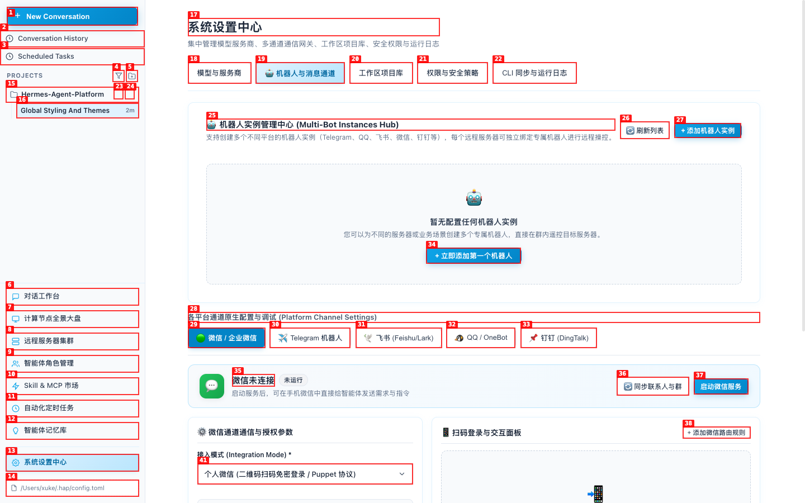

2. Change the platform to **WeChat / WeCom**.

3. **Observe:** the only credential field claims that leaving it empty enables web QR login, but
   the dialog contains no QR lifecycle controls or chatbot account state.
   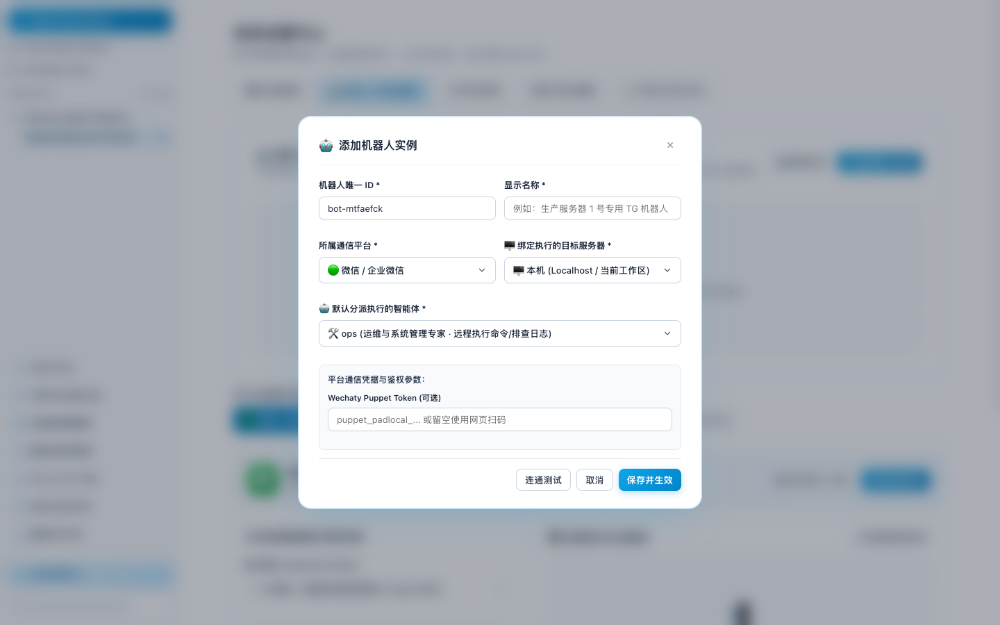

---

### ISSUE-002: Server-to-bot binding is split across incompatible configuration surfaces

| Field | Value |
|-------|-------|
| **Severity** | high |
| **Category** | functional / ux |
| **URL** | Remote Servers > Add server; Compute Dashboard > Node bot settings |
| **Repro Video** | N/A (static configuration defect) |

**Description**

The server form offers an optional binding to a reusable bot instance. The node dashboard instead
opens a second form that directly stores a Feishu/WeChat/Telegram alert webhook and agent settings.
The second form cannot select the bot instance from the first form and contains no inbound sender
allowlist, command permissions, approval policy, or visible routing identity. The dashboard also
claims that a Feishu bot and automatic remediation are enabled while its credential fields are
empty. Expected: one authoritative bot binding per server, with one platform, one account, one
agent, and explicit control permissions. Actual: alert delivery and bot-instance binding can
diverge and do not form a verifiable inbound control plane.

**Repro Steps**

1. Open **Remote Servers > Add server** and inspect the optional bot-instance selector.
   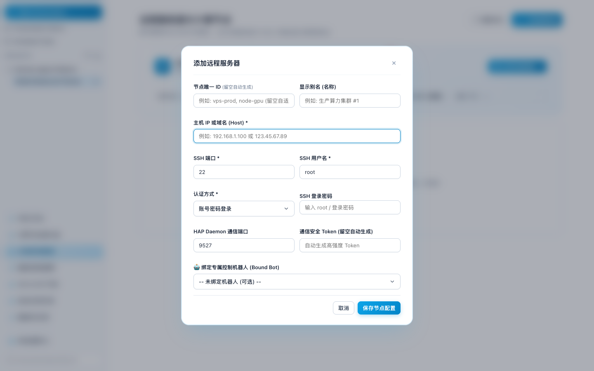

2. Open **Compute Dashboard > Node bot & alert settings**.

3. **Observe:** the modal asks for a separate alert channel and webhook rather than the reusable
   bot instance, and exposes no inbound control authorization.
   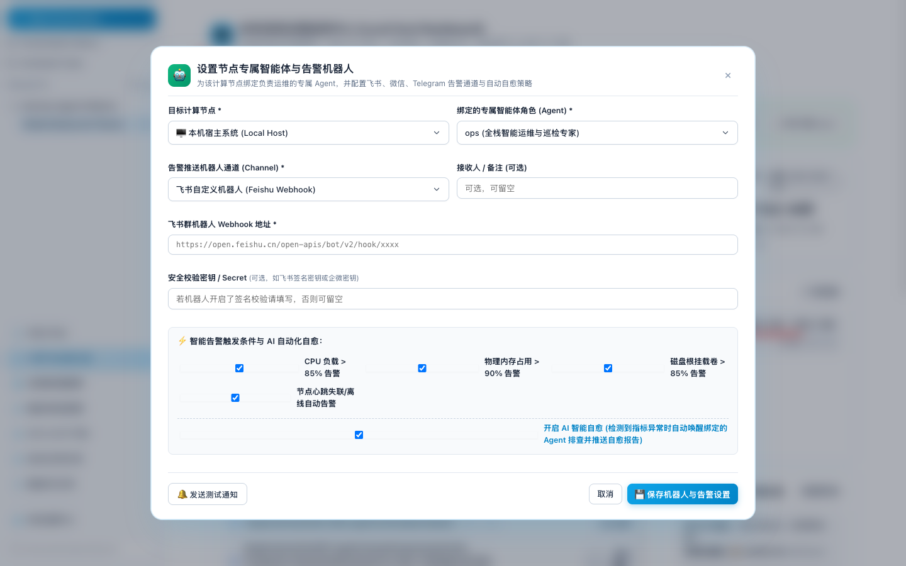

4. Close the modal and observe that the dashboard reports a bound Feishu bot and automatic
   remediation even though no bot credential is configured.
   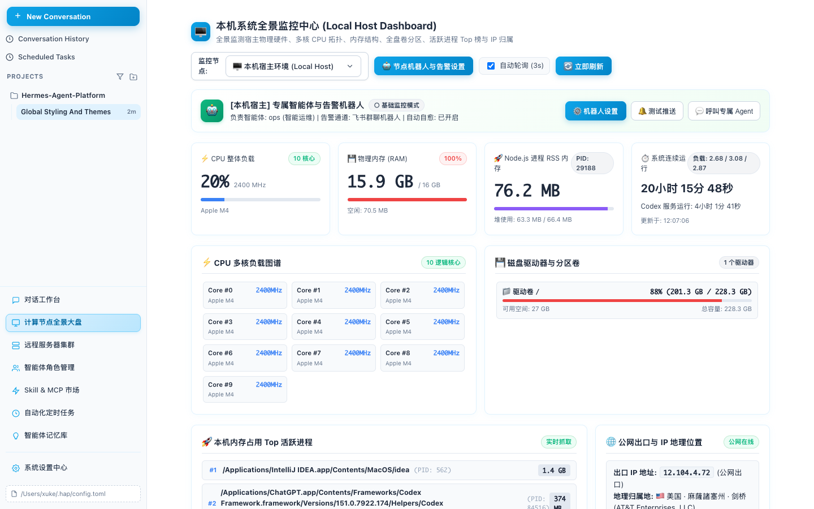

---

### ISSUE-003: Token usage is not visible in real time and `/usage` is routed as an agent task

| Field | Value |
|-------|-------|
| **Severity** | high |
| **Category** | functional / ux |
| **URL** | Conversation workspace; Compute Dashboard |
| **Repro Video** | N/A (result is visible after the command completes) |

**Description**

Neither the conversation header nor the compute dashboard shows current-turn, session, agent,
server, or total token usage. Sending `/usage` in the GUI does not open a usage view or return a
usage aggregate; it is inserted into the conversation and handled as a normal agent request.
Expected: token counters update while provider usage events arrive and settle to the persisted
totals at task completion. Actual: there is no visible token telemetry or GUI command fallback.

**Repro Steps**

1. Open the conversation workspace and submit `/usage`.
   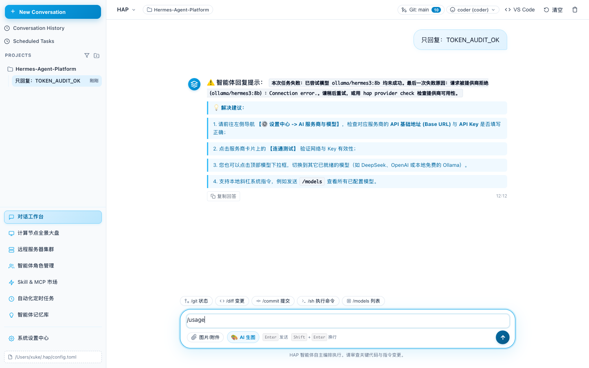

2. Wait for the response.

3. **Observe:** `/usage` appears as a user task and the reply contains generic remote-collaboration
   instructions rather than token totals. No token counter appears elsewhere on the page.
   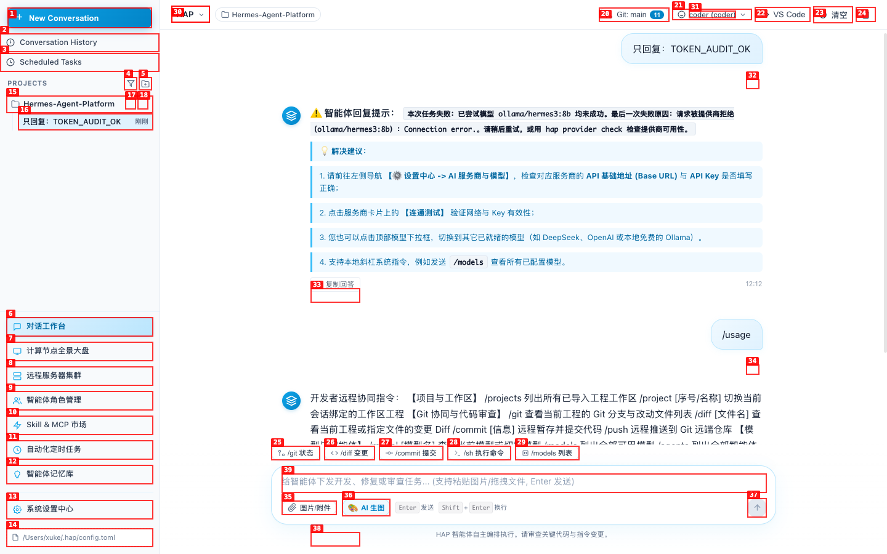

4. Open the compute dashboard and observe that it contains hardware metrics only, with no token
   telemetry for the selected node.
   

---

### ISSUE-004: A model shown as ready fails its first real request

| Field | Value |
|-------|-------|
| **Severity** | medium |
| **Category** | functional / content |
| **URL** | Conversation workspace |
| **Repro Video** | N/A (persistent result state) |

**Description**

The model selector marks local `hermes3:8b` with a green ready indicator. A minimal request using
that selected model fails with `Connection error` and reports that every attempted model failed.
Expected: the ready indicator reflects a recent provider probe, or changes to unavailable before
the user submits. Actual: stale readiness makes an unavailable provider look operational.

**Repro Steps**

1. In the conversation workspace, leave the green `hermes3:8b ... 就绪` model selected.

2. Submit `只回复：TOKEN_AUDIT_OK` and wait for completion.

3. **Observe:** the request ends in a connection error even though the model remains green and
   labeled ready.
   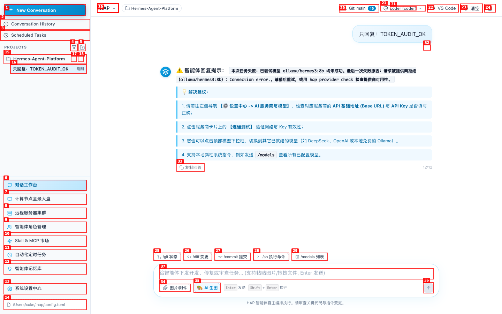

---

### ISSUE-005: Server-control channels default to unrestricted or expose no sender policy

| Field | Value |
|-------|-------|
| **Severity** | high |
| **Category** | functional / ux / security |
| **URL** | System Settings > Bot & Channels > Telegram / Feishu |
| **Repro Video** | N/A (static configuration defect) |

**Description**

Telegram explicitly states that an empty allowed-user field permits every user. Feishu exposes no
sender allowlist, pairing workflow, role, or command-scope field at all. These defaults may be
tolerable for a passive chatbot, but they are unsafe when the same bot can execute commands on a
bound server. Expected: remote control defaults to deny, requires at least one verified operator,
and separates read-only commands from mutating or destructive operations. Actual: the visible
configuration either defaults to all senders or offers no sender policy.

**Repro Steps**

1. Open **System Settings > Bot & Channels > Telegram**.

2. **Observe:** the allowed-user placeholder says that leaving the field empty allows every user.
   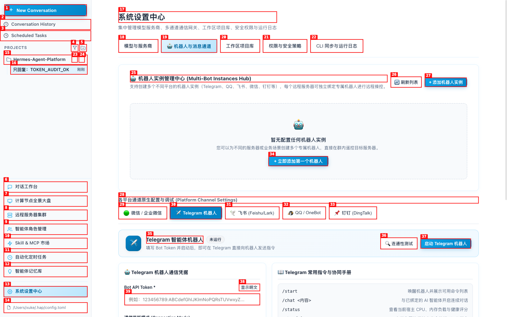

3. Switch to **Feishu**.

4. **Observe:** App ID, App Secret, encryption, verification and default agent are available, but
   there is no sender authorization or control permission policy.
   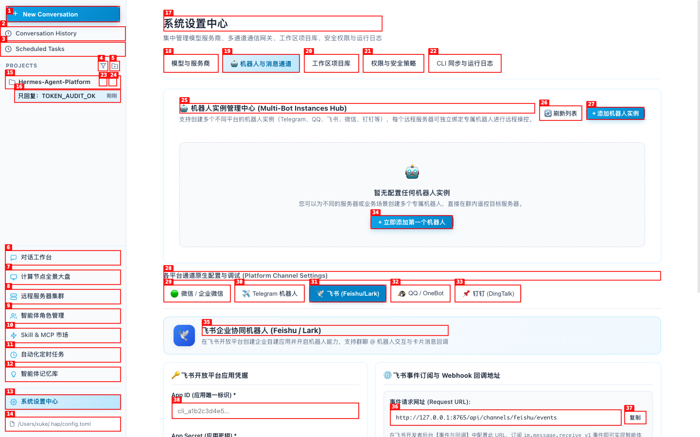

---

### ISSUE-006: One server accepts multiple bot bindings and unverified bots appear running

| Field | Value |
|-------|-------|
| **Severity** | high |
| **Category** | functional / ux |
| **URL** | System Settings > Bot & Channels > Bot instances |
| **Repro Video** | [videos/issue-006-repro.webm](videos/issue-006-repro.webm) |

**Description**

The bot-instance form allows the same local server to be selected repeatedly. Two Telegram bots
with synthetic credentials can be saved against that server without running the connection test.
Both cards immediately display a green `运行中` status. Expected: saving a second binding for the
same server is rejected or performs an explicit replacement, and runtime state is derived from a
live channel process. Actual: cardinality is not enforced and saved configuration is presented as
runtime health.

**Repro Steps**

1. Open **System Settings > Bot & Channels** with no existing bot instances.
   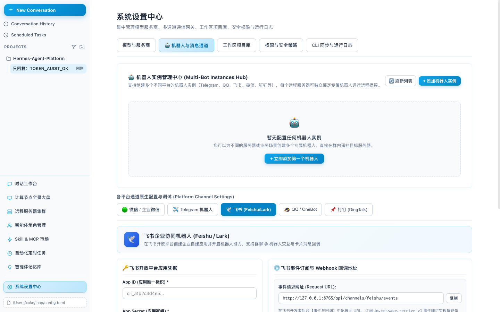

2. Add a Telegram bot, leave the server set to **Localhost**, and choose the `ops` agent.
   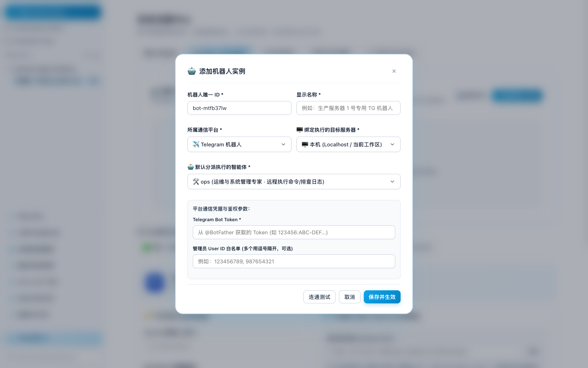

3. Enter synthetic credentials and save without selecting **Connection test**.
   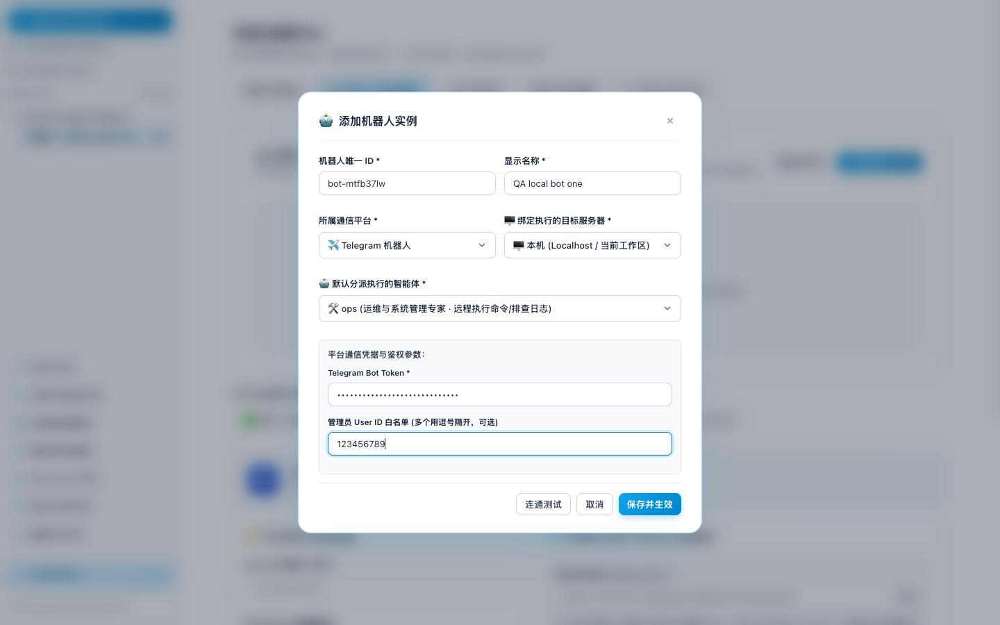

4. Observe that the instance is immediately shown with a stop action, implying that it is running.
   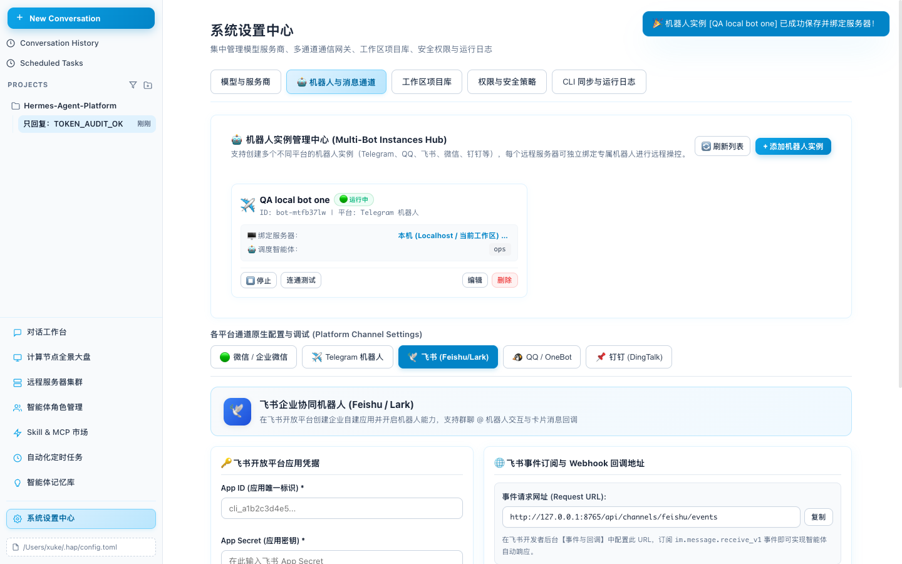

5. Add a second Telegram bot and leave it bound to the same local server.
   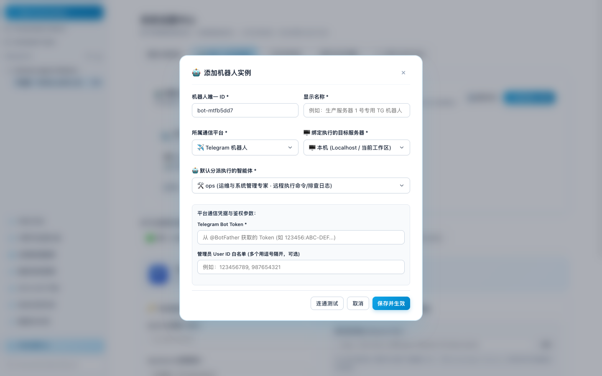

6. **Observe:** both bot cards are accepted for one server and both show green `运行中` status.
   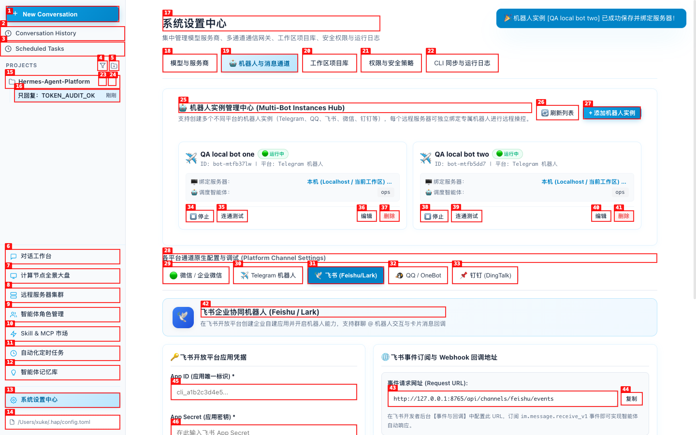

---
