# Dogfood Report: Hermes Agent Platform

| Field | Value |
|-------|-------|
| **Date** | 2026-08-30 |
| **App URL** | Electron local app (CDP 9333) |
| **Session** | hermes-hap-electron-qa |
| **Scope** | Full desktop UI: navigation, buttons, dialogs, forms, blank states, console errors, and visual consistency |

## Summary

| Severity | Count |
|----------|-------|
| Critical | 0 |
| High | 1 |
| Medium | 6 |
| Low | 1 |
| **Total** | **8** |

## Remediation Verification (2026-08-30)

All eight findings were replayed against a fresh Electron build on CDP port 9333. Functional checks were performed through the same user-visible controls used by the original dogfood run.

| Issue | Result | Verification evidence |
|-------|--------|-----------------------|
| ISSUE-001 | PASS (not reproducible in current build) | WeChat configuration is compact, labeled, and horizontally contained at desktop, 900x700, and 720x600. [900x700](screenshots/fixed-wechat-900x700.png), [720x600](screenshots/fixed-wechat-720x600.png) |
| ISSUE-002 | PASS | AI image, global environment, add-bot, node-bot header, dashboard bot settings, and test-push entry points all remain interactive and open the expected modal or guidance state. [AI image](screenshots/fixed-ai-image-modal.png), [environment](screenshots/fixed-env-modal.png), [add bot](screenshots/fixed-add-bot-modal.png), [node bot](screenshots/fixed-node-bot-modal.png) |
| ISSUE-003 | PASS | All 22 `.btn-close` controls expose the accessible name and tooltip `关闭`; the live DOM reports 0 unnamed close buttons. |
| ISSUE-004 | PASS | The top-level Scheduled Tasks control activates the `schedules` view. [Result](screenshots/fixed-scheduled-tasks.png) |
| ISSUE-005 | PASS | The local disk now reports 88% for 201.3 GB used of 228.3 GB, with a matching progress bar. [Dashboard](screenshots/fixed-dashboard-full.png) |
| ISSUE-006 | PASS | The local dashboard renders six top processes and resolves the public-IP widget to `公网在线`; repeated polling remains responsive. [Dashboard](screenshots/fixed-dashboard-full.png) |
| ISSUE-007 | PASS | After entering `QA_DRAFT_SHOULD_CLEAR` and creating a new conversation, `chatInput` is empty and Send is disabled. [Result](screenshots/fixed-new-chat-empty.png) |
| ISSUE-008 | PASS | After switching settings sections, the live DOM contains exactly one active settings tab. [Result](screenshots/fixed-wechat-settings.png) |

Responsive checks found no horizontal page overflow at 900x700 or 720x600. At 720x600, the node-bot dialog remains inside the viewport and exposes its longer content through the dialog's own scroll area. [Responsive dialog](screenshots/fixed-node-bot-720x600.png)

Automated verification: `npm test` passed 502/502 tests, `npm run typecheck` passed, `npm run build` passed, and ESLint passed for the modified renderer JavaScript. The repository-wide `npm run lint` remains blocked by the pre-existing ESLint configuration, which does not load a TypeScript parser and reports parsing errors across the existing `.ts` codebase.

## Issues

<!-- Findings are appended here immediately after reproducibility is confirmed. -->

### ISSUE-001: WeChat channel form expands into a mostly blank white page

| Field | Value |
|-------|-------|
| **Severity** | medium |
| **Category** | visual / ux / accessibility |
| **URL** | System Settings > Bot & Channels > WeChat |
| **Repro Video** | N/A (static issue) |

**Description**

The WeChat channel configuration renders as an extremely tall white region. Several form controls are separated by hundreds of pixels, their visible labels are missing, and the QR/login panel is blank. Expected: the configuration fields and QR panel should form a compact, labeled two-column layout. Actual: users must scroll through large empty areas and cannot reliably identify the scattered controls. Switching away from the tab and returning reproduces the same layout.

**Repro Steps**

1. Open **System Settings**, select **Bot & Channels**, then leave **WeChat / WeCom** selected.
2. Scroll through the full page and observe the blank configuration region and unlabeled controls near the bottom.
   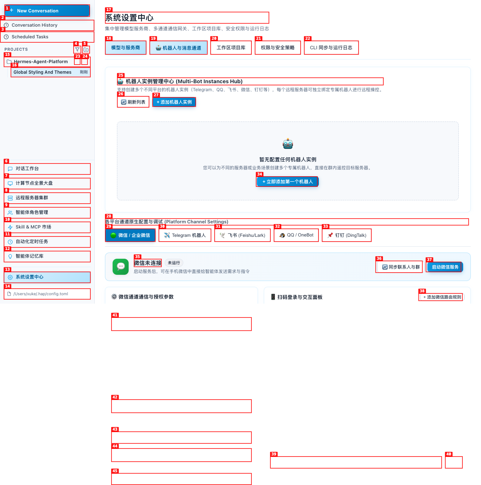

---

### ISSUE-002: Several key configuration entry points are nonfunctional; some freeze all interaction

| Field | Value |
|-------|-------|
| **Severity** | high |
| **Category** | functional / ux |
| **URL** | Chat workspace; System Settings > Bot & Channels; System Settings > Models; Compute Dashboard |
| **Repro Video** | [videos/issue-002-repro.webm](videos/issue-002-repro.webm) |

**Description**

Clicking **AI image generation**, **Add bot instance**, **Global environment variables**, **Node bot & alert settings**, the dashboard card's **Bot settings**, or **Test notification** does not open the expected view or provide feedback. **Add bot instance** was reconfirmed in the final pass: the renderer's interactive accessibility tree became empty and subsequent navigation stopped responding while the last frame remained painted. Reloading the Electron renderer is the only verified recovery from this inert state. AI image generation and global environment variables produced the same failure in earlier retries. The three dashboard buttons consistently remained visual no-ops; earlier retries also reached the inert state, while the final clean retry kept navigation available. No application console error was emitted in either failure mode.

Other dialogs (Add server, Edit agent, Add MCP, New automation, Add memory, Add project, Add provider) remain functional, which isolates the failure to these specific entry points rather than all Electron modals.

Focused dashboard retesting did **not** reproduce a freeze from entering the dashboard itself. Both the left navigation item and **Remote server cluster > Enter local panorama desktop** opened the dashboard successfully. Manual refresh, 12 seconds of 3-second auto-polling, and navigating away also remained responsive. The dashboard defect is limited to its configuration/notification controls, not initial page entry.

**Repro Steps**

1. Open **System Settings > Bot & Channels** and locate **Add bot instance**.
   

2. Click **Add bot instance** and wait. No dialog or loading state appears; the screen is unchanged and the interactive tree becomes empty.
   

3. Click **Telegram bot**. The active tab remains WeChat, confirming that other controls are now frozen.
   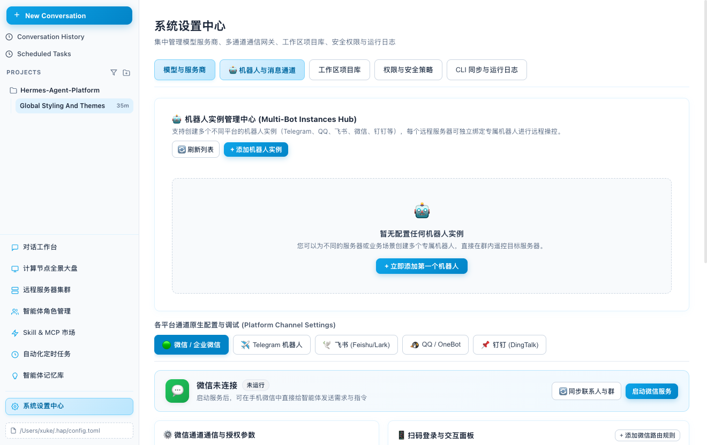

4. The same freeze is independently reproducible from **Compute Dashboard > Node bot & alert settings**; clicking System Settings afterward leaves the dashboard unchanged.
   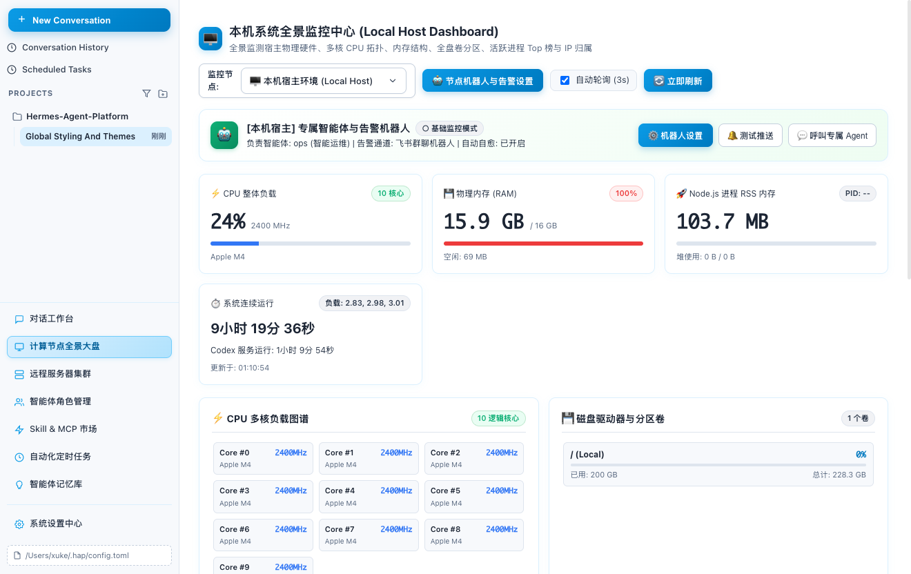

5. The same freeze is independently reproducible from **Chat workspace > AI image generation**; the previous chat remains painted but all controls become inert.
   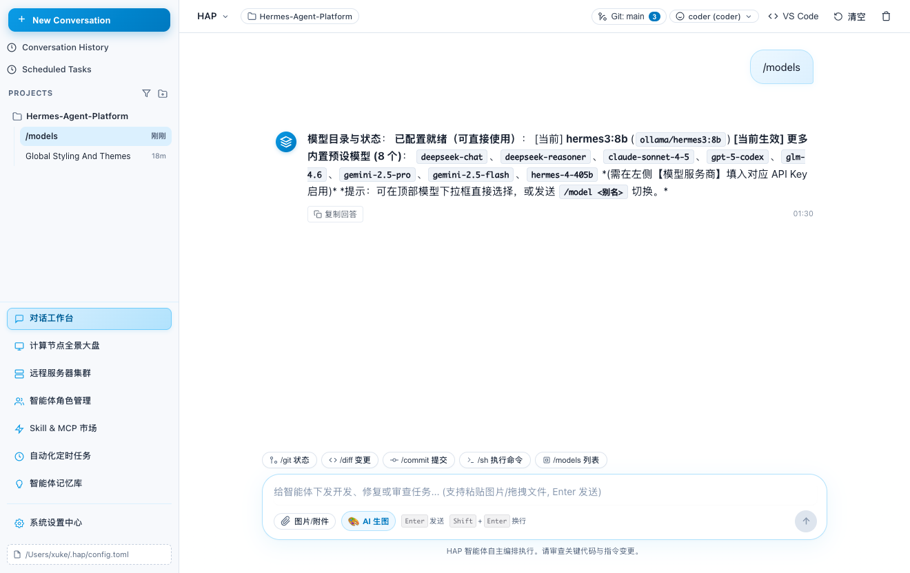

6. The dashboard card's separate **Bot settings** button reproduces the same freeze.
   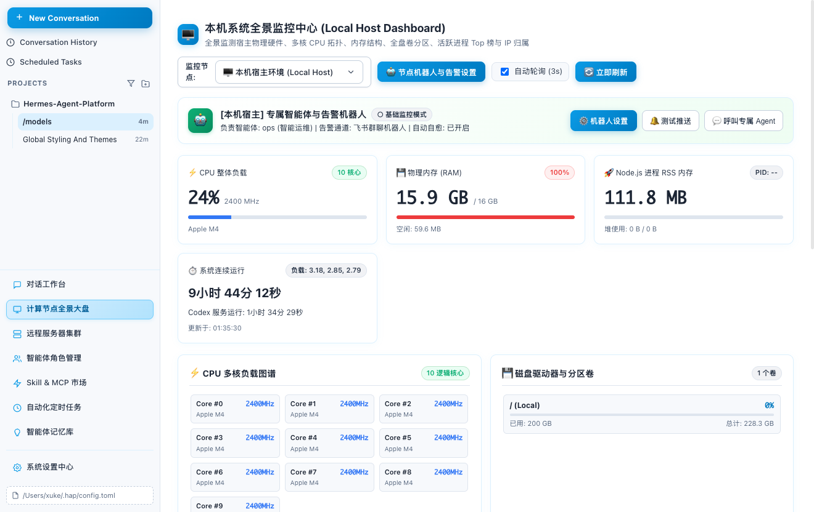

7. The dashboard card's **Test notification** button also reproduces the same freeze instead of showing success or failure feedback.
   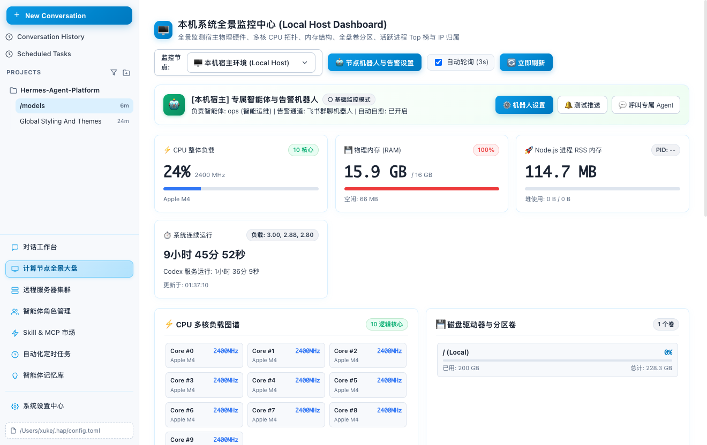

---

### ISSUE-003: Modal close buttons have no accessible name

| Field | Value |
|-------|-------|
| **Severity** | low |
| **Category** | accessibility |
| **URL** | Multiple add/edit dialogs |
| **Repro Video** | N/A (static issue) |

**Description**

The icon-only close control in every checked modal is exposed only as an unnamed `button`. This was reproduced in Add server, Edit agent, Add custom MCP, Install Skill, New automation, Add memory, Add project, and Add provider dialogs. Keyboard and screen-reader users cannot determine the control's purpose. Expected: an accessible name such as `Close` / `关闭` and a visible tooltip.

**Repro Steps**

1. Open **System Settings > Models & Providers > Add AI provider and model**.
2. Inspect the annotated close control at marker 2; the legend identifies it only as `button`, with no name.
   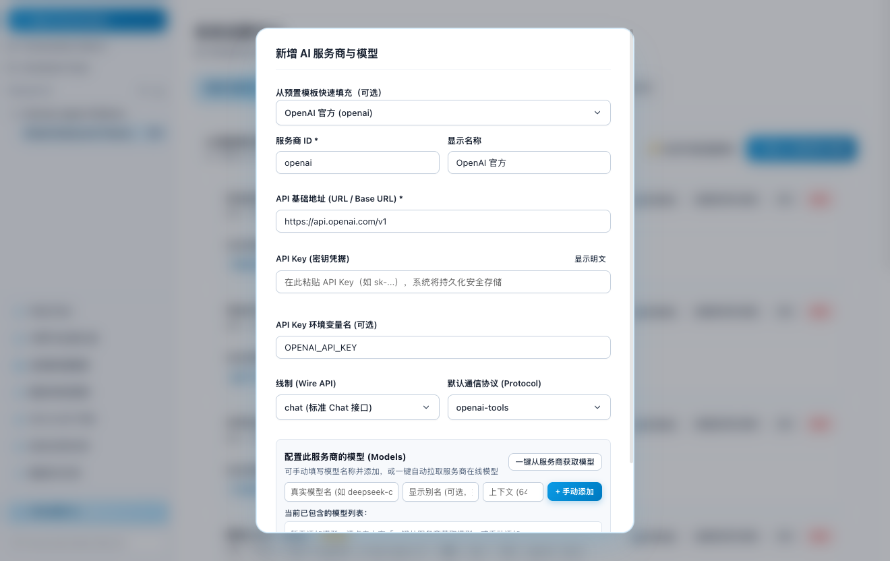

---

### ISSUE-004: Top-level Scheduled Tasks link opens Runtime Logs

| Field | Value |
|-------|-------|
| **Severity** | medium |
| **Category** | functional / ux / content |
| **URL** | Top-left navigation > Scheduled Tasks |
| **Repro Video** | [videos/issue-004-repro.webm](videos/issue-004-repro.webm) |

**Description**

The prominent top-left **Scheduled Tasks** navigation item opens a page headed **运行日志** (Runtime Logs) with log filters. It does not open scheduled tasks. A separate lower-sidebar item named **自动化定时任务** opens the actual automation page, so the two entry points conflict. Expected: Scheduled Tasks should route to the automation scheduler, or be renamed Runtime Logs.

**Repro Steps**

1. From the chat workspace, locate **Scheduled Tasks** at marker 3 in the top-left navigation.
   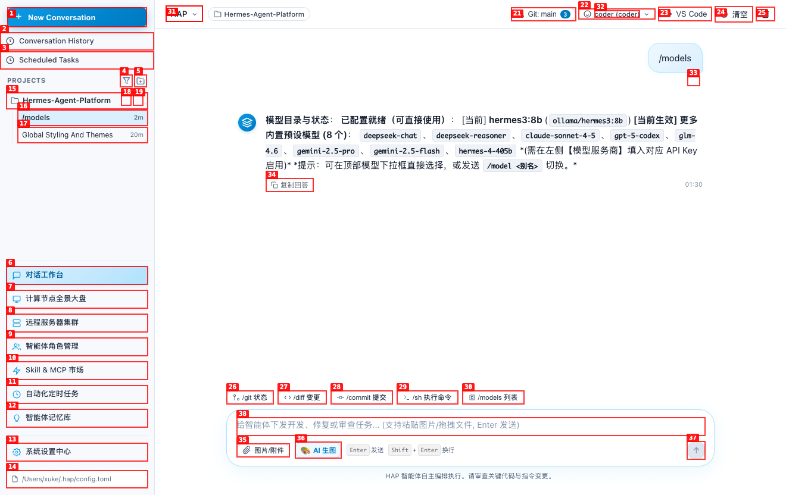

2. Click **Scheduled Tasks**.
3. **Observe:** the destination heading is **运行日志**, with All / Errors / Info filters rather than scheduled jobs.
   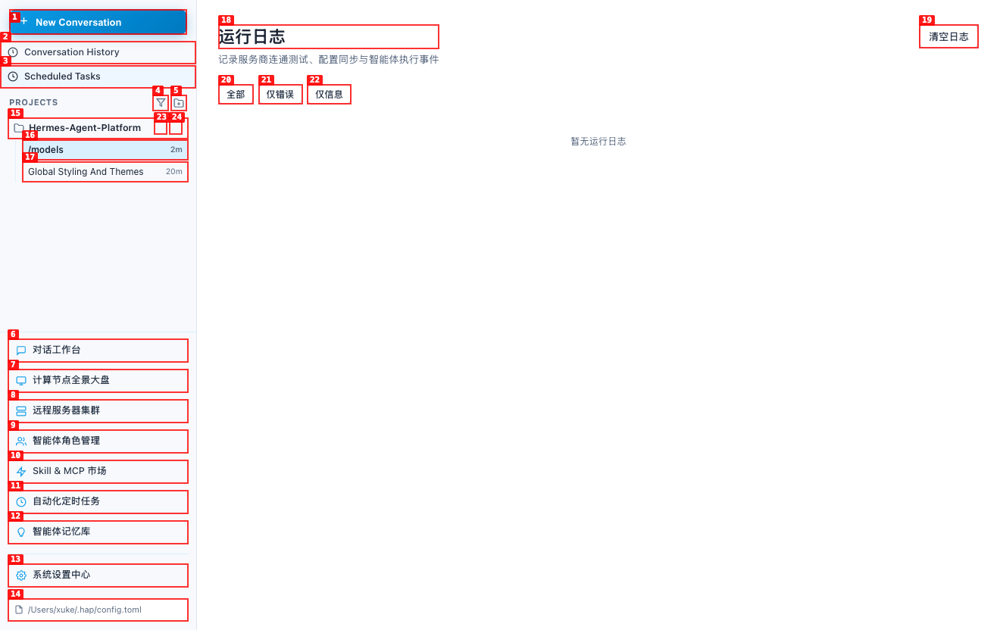

---

### ISSUE-005: Disk utilization percentage contradicts the displayed byte totals

| Field | Value |
|-------|-------|
| **Severity** | medium |
| **Category** | functional / content |
| **URL** | Compute Dashboard |
| **Repro Video** | N/A (static issue) |

**Description**

The local disk card reports **Used: 200 GB**, **Total: 228.3 GB**, but shows **0%** utilization and an empty progress bar. The displayed values imply approximately 87.6% utilization. This makes the monitoring dashboard materially misleading.

**Repro Steps**

1. Open **Compute Dashboard**.
2. Inspect **Disk drives and partitions > / (Local)**.
3. **Observe:** 200 GB used of 228.3 GB is rendered as 0%.
   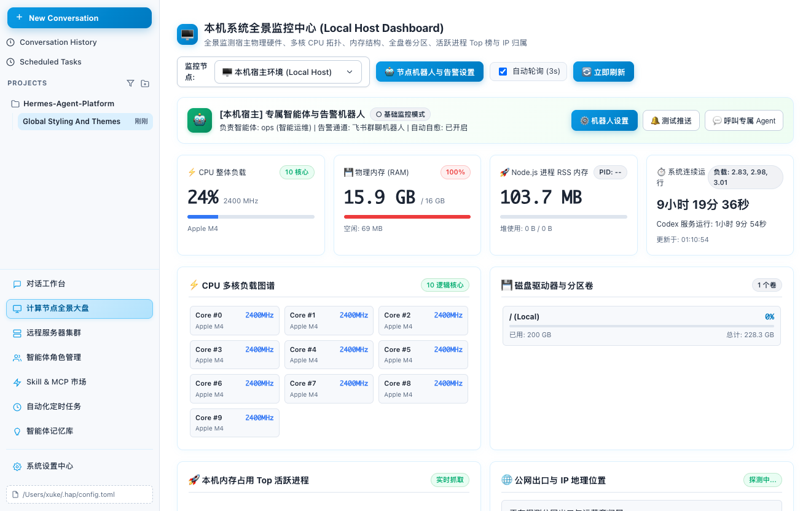

---

### ISSUE-006: Live process and public-IP widgets never leave blank/loading states

| Field | Value |
|-------|-------|
| **Severity** | medium |
| **Category** | functional / ux |
| **URL** | Compute Dashboard |
| **Repro Video** | N/A (persistent static state) |

**Description**

The **Top active processes** card remains completely blank while labeled as live capture, and **Public egress & IP location** remains on **Detecting...** without data or an error state. Both persisted across repeated 3-second auto-polls, manual refresh, page reloads, and more than 30 minutes of observation. No console error was exposed.

**Repro Steps**

1. Open **Compute Dashboard** and wait for several auto-poll cycles.
2. Click **Refresh now** and wait again.
3. Scroll below the CPU/disk cards.
4. **Observe:** process content is blank and IP detection remains indefinitely pending.
   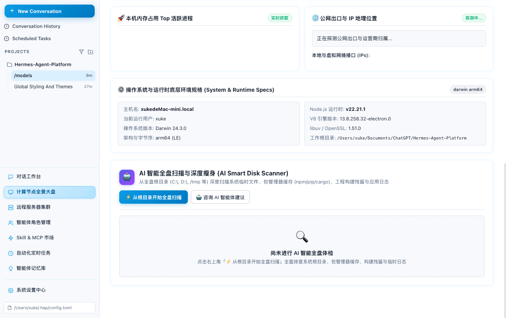

---

### ISSUE-007: New Conversation carries an unsent draft into the new chat

| Field | Value |
|-------|-------|
| **Severity** | medium |
| **Category** | functional / ux |
| **URL** | Chat workspace |
| **Repro Video** | [videos/issue-007-repro.webm](videos/issue-007-repro.webm) |

**Description**

Creating a new conversation preserves the unsent composer draft from the previous conversation. The new chat is listed separately, but its input already contains the old text and the Send button is enabled. Expected: a new conversation starts with an empty composer, or drafts are retained per conversation without leaking between sessions.

**Repro Steps**

1. Enter `QA_DRAFT_SHOULD_CLEAR` in an existing chat without sending it.
   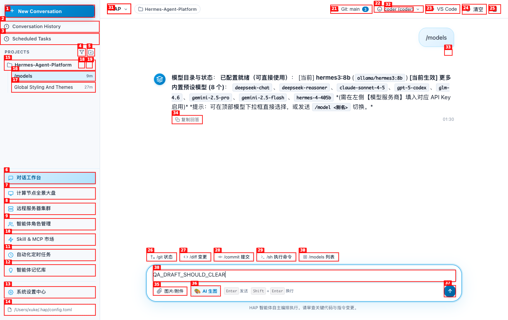

2. Click **New Conversation**.
3. **Observe:** a new chat is created, but `QA_DRAFT_SHOULD_CLEAR` remains in the composer.
   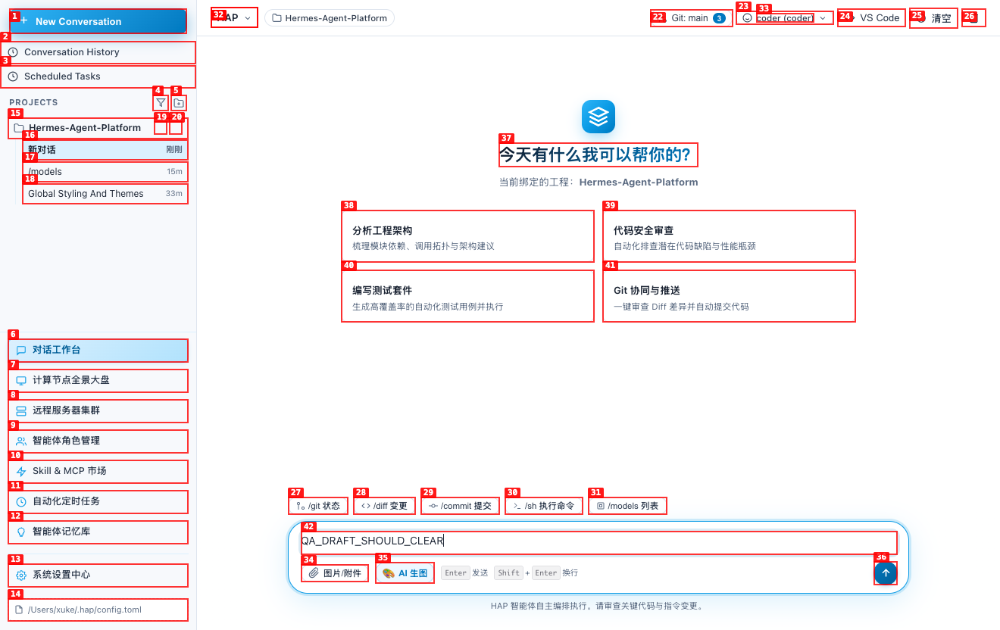

---

### ISSUE-008: System settings shows two tabs as active at the same time

| Field | Value |
|-------|-------|
| **Severity** | medium |
| **Category** | visual / ux |
| **URL** | System Settings |
| **Repro Video** | N/A (static issue) |

**Description**

After selecting **Bot & Channels**, **Permissions & Security**, or **CLI Sync & Runtime Logs**, the default **Models & Providers** tab keeps the same blue active styling as the selected tab. Two tabs therefore appear active even though only one page is displayed. Expected: exactly one tab communicates the current settings section.

**Repro Steps**

1. Open **System Settings**.
2. Select **Permissions & Security**.
3. **Observe:** both **Models & Providers** (marker 18) and **Permissions & Security** (marker 21) are rendered in the blue active state.
   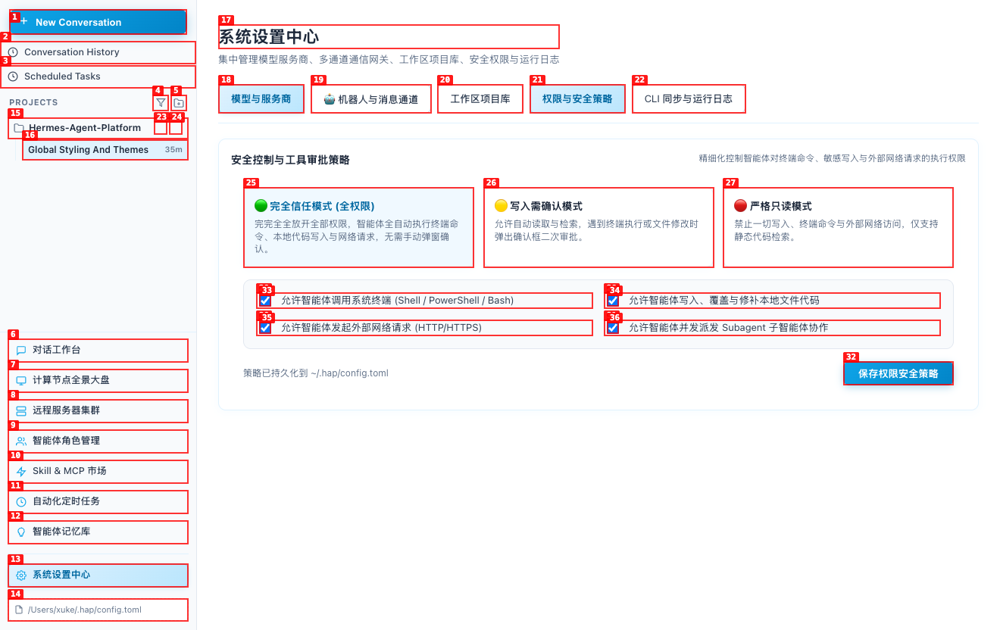

---
